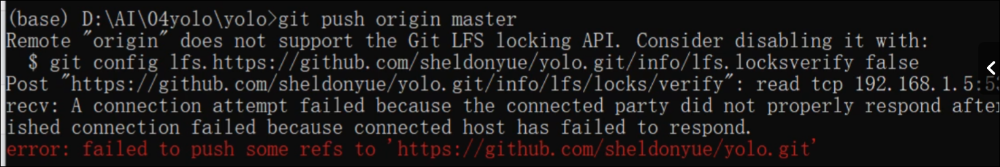

# 大文件上传GitHub
##### 实例：上传游戏
步骤如下：
1. 下载git lfs
```http://git-lfs.github.com/```
tips：必须下载在git的路径中
#### 路径：
```
.\Git\bin
```
2. 上传过程：
```
git init  # 初始化
git lfs install   # 安装大文件上传应用
git lfs track *   # 追踪要上传的大文件，*表示该文件内全选，也可以"文件名"或"文件.格式"
git add .gitattributes  # 添加上传文件的属性文件
git commit -m "xxx"   #属性上传文件的说明
git remote add orogin xxx   # 建立本地与GitHub仓库的链接
git push origin master    # 上传属性文件
git add *   # 添加要上传的大文件
git commit -m "xxx"   # 添加大文件的说明
git push origin master    #最后一步上传！！！
```

3. （有可能没有？？？谁知道呢.jpg）
网络可能会出现问题，导致上传失败，如下图所示：

那该咋办呢？原因是网络问题
从这重新开始再来一遍
```
git add *
git commit -m "xxx"
```
